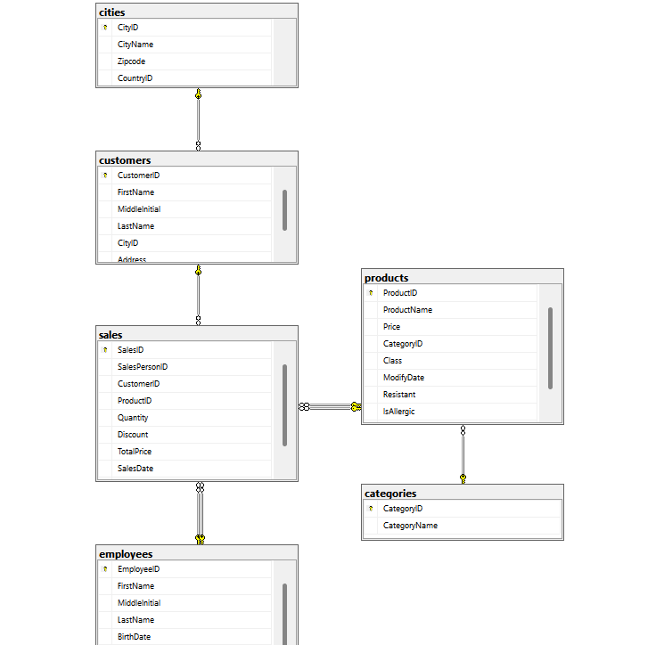

# 🛒 Grocery Sales Analytics
**SQL Business Analysis | Microsoft SQL Server · T-SQL · Data Analytics**

---

## 📌 Project Overview

A grocery store had strong overall sales — but little visibility into *why* performance looked good. Revenue data existed across products, customers, regions, and sales staff, but the insights were buried in raw, disconnected tables.

The business couldn't clearly answer:
- Which products were actually driving revenue
- Which regions were overperforming or underperforming
- Which customers generated the most income
- Which sales staff were excelling — and which weren't

This project rebuilds that visibility from the ground up: a Kaggle grocery sales dataset was loaded into a relational SQL Server database, modeled with proper table relationships, and interrogated with 13 SQL queries answering real business questions.

> **The goal:** Turn scattered sales tables into clear, data-backed answers stakeholders can act on.

---

## 🛠️ Tech Stack

| Tool | Purpose |
|------|---------|
| Microsoft SQL Server | Relational database, data cleaning, T-SQL analysis |
| T-SQL | Business-question queries, joins, window functions, CTEs |
| Kaggle | Source dataset (7 relational CSV files) |

---

## 📂 Repository Structure

```
grocery-sales-analytics/
│
├── data/
│   ├── categories.csv
│   ├── cities.csv
│   ├── countries.csv
│   ├── customers.csv
│   ├── employees.csv
│   ├── products.csv
│   └── sales.csv
│
├── sql/
│   └── grocery_sales_analysis.sql       # All 13 business-question queries
│
├── assets/
│   └──  er_diagram.png                   # Database relationship diagram
│
└── README.md
```

---

## 📊 Key Performance Indicators

| KPI | Value |
|-----|-------|
| 💰 Total Revenue | $957.88M |
| 🧾 Total Orders | 1.45M |
| 📦 Total Quantity Sold | 18.86M |
| 🛍️ Average Order Value (AOV) | $659.98 |

---

## ⚙️ Project Pipeline

```
Phase 1 → Data Sourcing & Import
Phase 2 → Data Cleaning & Preparation
Phase 3 → Data Modelling (ER Diagram)
Phase 4 → SQL Analysis — 13 Business Questions
Phase 5 → Insights & Recommendations
```

---

## 🧹 Phase 1–2: Data Sourcing & Cleaning

- Sourced a grocery sales dataset from Kaggle, split across 7 relational CSV files: `categories`, `cities`, `countries`, `customers`, `employees`, `products`, `sales`
- Created a SQL Server database and imported all 7 tables
- Fixed inconsistent column datatypes
- Removed invalid/null sales dates
- Verified referential integrity across foreign keys before modelling

---

## 🔄 Phase 3: Data Modelling

Tables were connected into a relational model linking sales, products, categories, customers, cities, countries, and employees — giving every query a single, consistent source of truth to join against.



**Core relationships:**
- `sales` is the central fact table, linking to `customers`, `products`, and `employees`
- `products` links to `categories`
- `customers` link to `cities`, which link to `countries`

---

## 💻 Phase 4: SQL Analysis — 13 Business Questions

All queries live in [`sql/grocery_sales_analysis.sql`](sql/grocery_sales_analysis.sql). They're grouped into five analysis areas:

### 1. Monthly Sales Performance
- Total revenue generated per month
- Monthly revenue compared across product categories

### 2. Product Performance
- Products ranked by total revenue (`DENSE_RANK()`)
- Top 10 products by demand (quantity sold and price)
- Revenue impact of product category/classification

### 3. Customer Purchase Behavior
- Customers segmented by purchase frequency and total spend
- Repeat buyers vs. one-time buyers *(finding: every customer in the dataset made more than one purchase — no one-time buyers)*
- Average order value and basket size, computed across all orders

### 4. Salesperson Effectiveness
- Total sales attributed to each salesperson
- Salesperson performance tracked month-over-month
- Top and bottom performers identified via CTE (highest and lowest total sales)

### 5. Geographical Sales Insights
- Revenue mapped to cities and countries
- Sales volume compared across geographic areas

**Example — Average Order Value & Basket Size:**
```sql
SELECT
    ROUND(SUM(s.Quantity * p.Price), 2) AS TotalRevenue,
    COUNT(DISTINCT s.SalesId) AS TotalOrders,
    ROUND(SUM(s.Quantity * p.Price) / COUNT(DISTINCT s.SalesId), 2) AS AOV,
    ROUND(SUM(s.Quantity) * 1.0 / COUNT(DISTINCT s.SalesID), 2) AS BasketSize
FROM sales s
JOIN products p ON s.ProductID = p.ProductID;
```
---

**Top revenue-generating cities (February view):**

| City | Total Revenue |
|------|---------------|
| Sacramento | $1,610,336.40 |
| Fort Wayne | $1,528,188.42 |
| Columbus | $1,501,819.23 |
| San Antonio | $1,393,982.04 |
| Phoenix | $1,390,517.55 |
| Jackson | $1,016,501.45 |

---

## 🔍 Phase 5: Key Insights & Recommendations

### Key Insights

| # | Insight |
|---|---------|
| 1 | Every customer in the dataset is a repeat buyer — there are no one-time purchasers, suggesting strong existing customer retention |
| 2 | Sacramento, Fort Wayne, and Columbus lead city-level revenue, with a noticeable gap down to lower-performing cities like Jackson |
| 3 | [Insert top product / category finding here — e.g. top-revenue product and its share of total sales] |
| 4 | [Insert salesperson performance spread — e.g. gap between top and lowest performer] |
| 5 | Monthly and category-level revenue trends are tracked consistently, giving a repeatable basis for spotting seasonal shifts |

### Recommendations

| # | Recommendation | Business Impact |
|---|---------------|----------------|
| 1 | Investigate why lower-performing cities (e.g. Jackson) lag the top cluster | Identify whether it's a demand, pricing, or staffing gap |
| 2 | Use the repeat-buyer finding to prioritize retention/loyalty programs over acquisition spend | Focus budget where it already converts |
| 3 | Track salesperson performance monthly rather than only in aggregate | Catch underperformance early and replicate what top performers do |
| 4 | Complete the regional sales-strategy effectiveness query | Move from "where sales happen" to "why they happen there" |

---

## 🎯 What I Focused On

| Focus Area | Approach |
|------------|---------|
| Data modelling | Clean relational schema across 7 source tables before any analysis |
| SQL analysis | 13 business questions answered with joins, aggregations, window functions, and CTEs |
| Business framing | Every query tied back to a real stakeholder question, not just a technical exercise |

---

## 📄 Deliverables

| Deliverable | Description |
|-------------|-------------|
| `grocery_sales_analysis.sql` | All 13 SQL queries answering the business questions |
| `data/*.csv` | Source dataset (7 relational tables) |
| `README.md` | Full project documentation |

---


## 🏷️ Tags

`#SQL` `#SQLServer` `#DataAnalytics` `#DataAnalyst` `#DataDrivenDecisions` `#RetailAnalytics`
